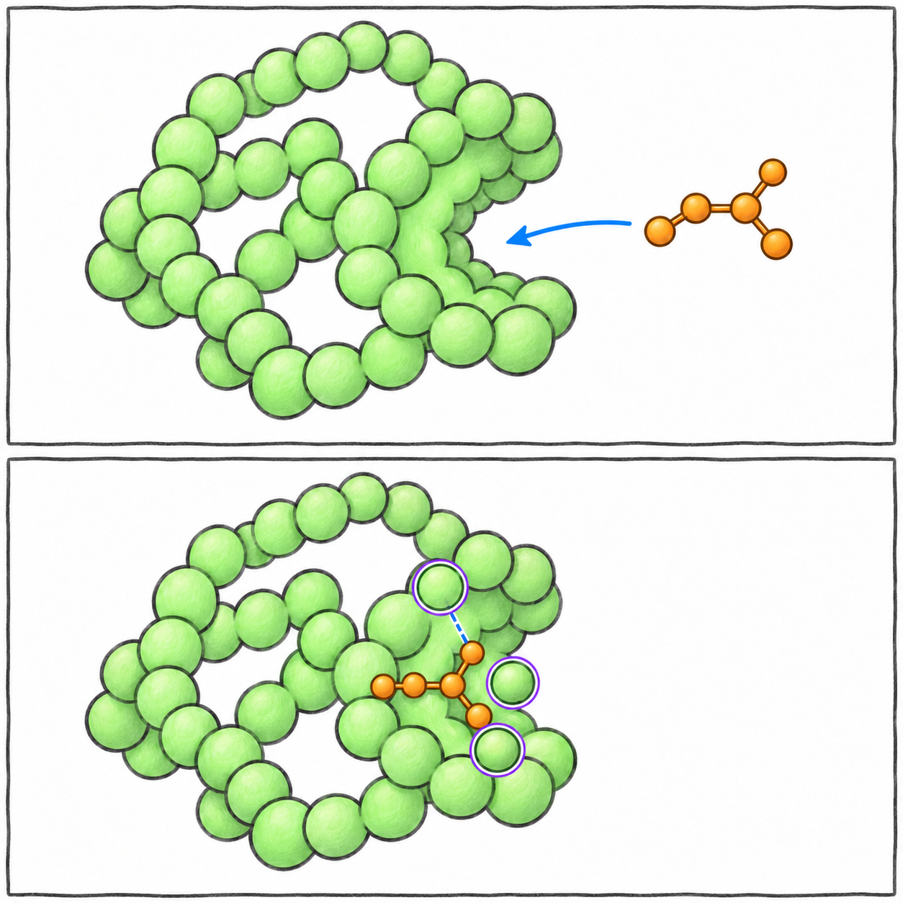
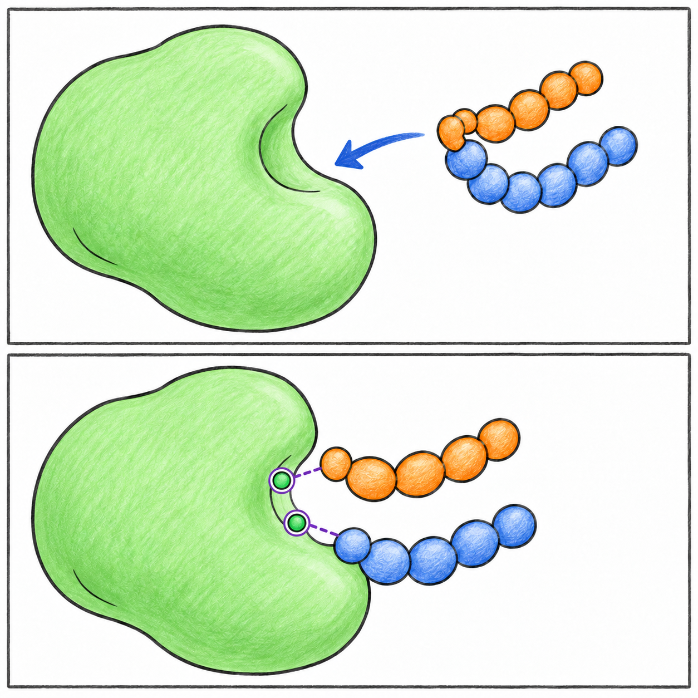
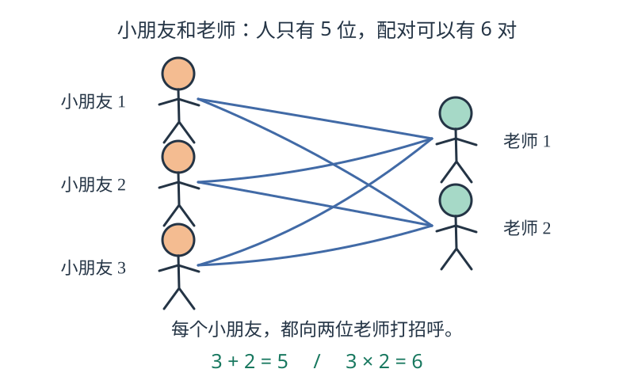

# 把药物与蛋白质讲给第一次听的人

这份讲稿先讲故事，再看真实图片。学生不需要先背生物名词，也不需要先学会编程。想自己运行或改代码时，请会一点 Python 的老师或同学陪着做。两课的计算、数据和实际输出都保留，方法说明集中在页面末尾的注释。

## 开场：只认识三件东西

可以这样说：

> 我们身体里有很多蛋白质。你先把蛋白质想成一长串小珠子。这串珠子会折起来，变成有特别形状的三维物体。有些蛋白质像小机器，能完成任务。
>
> 一颗珠子对应一个氨基酸。在蛋白质里，科学家也把它叫作“残基”。珠子里面还有更小的小部件，叫原子。今天不用背名称，先认识谁大、谁小。
>
> 我们来看两种药物怎样和蛋白质待在一起：一种小药物，像小积木出现在凹槽里；一种抗体药物，本身就是蛋白质，负责结合的一部分像一只有特别形状的手。

让学生转动模型，观察它在不同方向的样子。

## 第一课：小药物和蛋白口袋

使用伊马替尼与 ABL 的真实实验模型 [1IEP](https://www.rcsb.org/structure/1IEP)。这份模型来自小鼠 ABL 蛋白的一部分。它帮助我们学习怎样看结构。²数据和实验背景保留在课程的进阶说明中。

绿色是蛋白，橙色是小药物；紫圈标近邻，虚线标出量距离的位置。¹

### 先看三维图，暂时不看代码

> 先找橙色。橙色细棒是药物。现在转一转模型，看看它有多大、长什么样。
>
> 接着看绿色。绿色丝带帮助我们看清 ABL 蛋白的走向。你会发现蛋白质比药物大得多。
>
> ABL 平时要用到一个叫 ATP 的小分子。伊马替尼占住相关的口袋，会让 ABL 更容易保持不工作的形状。这个作用来自已有实验研究；今天的图帮助我们看清药物坐在哪里。

向学生提问：“橙色在哪里？绿色有多大？转动图片，药物会不会真的从蛋白里跑出来？”

参考回答：“我们改变的是看的方向，不是把药物搬走。”

### 用“找邻居”解释距离

> 假设我们在地图上找离学校很近的房子，需要先说清楚：多近才算近？
>
> 给药物找近邻也一样。我们约定，最近的原子距离不超过 4 Å，就把这个蛋白小部件算作近邻。Å 是很小很小的长度单位，先不用记换算。
>
> 计算后，找到 21 个近邻部件。

按当前数据与 4 Å 的选择规则，得到 21 个近邻部件。³

### 四种图片怎样解释

| 图片 | 先让学生看哪里 | 一句话解释 |
| --- | --- | --- |
| 最近距离柱形图 | 柱子的长短和虚线 | 一条柱子数一个部件；越短表示最近距离越小，虚线是我们选的边界。 |
| 彩色距离表 | 右边的色条，再看行和列 | 黄色偏近，蓝紫色偏远；每格表示一个药物原子到一个蛋白部件的最近距离。 |
| 三维散点图 | 橙点周围的紫点 | 长珠子串折起来，串上相隔很远的部件也能聚到一起。 |
| 口袋局部放大图 | 橙色药物与紫色细棒 | 这些蛋白原子围在药物附近；标签像门牌，不用背字母。 |

色条超过 8 Å 的值使用同一个最远颜色。别让学生只靠颜色比较这些较远的值。

### 用一个小问题解释“阈值”

问：“把学校附近 100 米改成 200 米，附近房子会不会多一些？”

再对应到模型：“把 4 Å 改成 5 Å，可能多算几个近邻。房子没搬，药物没动，变的是我们画圈的规则。科学家把这条边界叫‘阈值’。”

最后问：“邻居多了，药就更厉害了吗？”

参考回答：“不能这样说。我们只改了计数规则。药物结合得多牢、作用有多大，要另外做实验。”

## 第二课：抗体怎样贴到蛋白表面

使用曲妥珠单抗的结合片段与 HER2 的真实实验模型 [1N8Z](https://www.rcsb.org/structure/1N8Z)。这里展示抗体的 Fab 结合片段，以及 HER2 的胞外部分。²

橙色和蓝色是 Fab 的两条链，虚线连接 Fab 部件与绿色靶蛋白部件。¹

### 跟着三种颜色认识三个部分

> 绿色是 HER2，也就是今天被结合的蛋白。
>
> 橙色是 Fab 的轻链，标签 A。蓝色是 Fab 的重链，标签 B。“链”就是一串蛋白小部件；轻和重是两条链的名称。
>
> 你把模型转一转，找找橙色和蓝色在哪里贴近绿色。它们贴满了整个表面吗？还是集中在一小块地方？

参考回答：“在这个实验模型里，它们靠近一小块区域。”

告诉学生：“刚才的小药物进入口袋；这次看的是两个蛋白的表面相遇。”

### 用“打招呼”解释人数和配对数

先不展示公式，直接问：

> 三个小朋友，每人都和两位老师打招呼。小朋友有几个？老师有几位？可以组成几对“小朋友—老师”？

答案是：3 个小朋友、2 位老师、6 对配对。一个人可以出现在多对里。

再讲真实结果：

> 这个模型里，按 4 Å 的规则，找到 14 个 Fab 部件和 17 个 HER2 部件，组成 32 对近邻。
>
> 14 和 17 是两边的小部件数量；32 是配对数量。不要把它们当成同一种计数。

| 实际统计 | 数量 | 给学生的说法 |
| --- | ---: | --- |
| Fab 轻链 A 的近邻部件 | 8 | 橙色这一边数到了 8 个部件。 |
| Fab 重链 B 的近邻部件 | 6 | 蓝色这一边数到了 6 个部件。 |
| Fab 合计 | 14 | 抗体这一边一共 14 个部件。 |
| HER2 的近邻部件 | 17 | 绿色这一边一共 17 个部件。 |
| 两边的近邻配对 | 32 | 一共 32 对靠近的关系。 |

让学生分别指出轻链的 8 个部件和重链的 6 个部件。³

### 三张图怎样带着学生看

1. **彩色距离表。** 行是 Fab 部件，列是 HER2 部件，黄色偏近，蓝紫色偏远。一个部件可以靠近某个伙伴，却离另一个较远，所以整行不一定同色。
2. **沿 HER2 编号的散点图。** 横着是珠子串上的编号，竖着是最近距离。紫点符合 4 Å 的规则；看看紫点是不是集中在一小段。
3. **改变边界的曲线。** 几条线分别数两边的部件和配对。圈变大，近邻数不能减少。曲线展示距离边界与近邻计数的关系。³

## 一个容易记住的收尾

> 血红素像蛋白质本来就需要的工作部件。
>
> 伊马替尼像出现在工作位置附近的小积木，会影响 ABL 的工作。
>
> 抗体的 Fab 部分像一只有特别形状的手，贴近 HER2 的特定表面。
>
> 今天我们学会了三件事：认清模型里是谁，找谁靠近谁，用自己的话说出图片说明了什么。

收尾时请学生用自己的话说出药物的位置和近邻。⁴

## 五个小问题，听答案就知道学生有没有理解

| 问题 | 参考回答 |
| --- | --- |
| 把三维模型转过来，里面的真实距离会变吗？ | 不会，变的是看的方向。 |
| 把近邻边界从 4 Å 改成 5 Å，药物移动了吗？ | 没移动，计数规则变了。 |
| 一个部件能出现在两对近邻里吗？ | 能，就像一个人能和两位老师打招呼。 |
| 找不到近邻，要不要编一些填满图片？ | 不要，空结果也可以是正确答案。 |
| 两个小点站得很近，一定存在化学连接吗？ | 不一定，还要知道别的信息。 |

## 如果学生自己带来两个结构文件

可以分别打开看看。但两个文件像两张各自选了原点的地图，比较前需要确定两张地图如何对齐。⁴

本课使用同一个实验里已经观察到的复合物，双方位置能够一起比较。如果没有这样的记录，要确定可能的结合位置，是另一项需要专业方法和验证的任务，可以在下一步学习空间定位与对接方法。⁴

## 给老师保留的专业说明

- 计算用正占有率重原子的最小直线距离，默认 ≤4 Å；Cα 是每个氨基酸中一个特定的骨架原子，不能代表侧链的最近接触。方法和输入选择没有改变。
- ABL 数据为鼠源激酶结构域。作用机制见 [Nagar 等，2002](https://pubmed.ncbi.nlm.nih.gov/12154025/)及 [PDB-101](https://pdb101.rcsb.org/motm/283)。
- 抗体结构是 Fab 与人 HER2 胞外构建体；NAG 是糖组分。曲妥珠单抗是[人源化 IgG1 抗体](https://www.gene.com/download/pdf/herceptin_prescribing.pdf)，RCSB 的多来源实体标记不能代替药物的分类。结构背景见 [Cho 等，2003](https://doi.org/10.1038/nature01392)及 [PDB-101](https://pdb101.rcsb.org/motm/268)。
- 原子对、残基对和独立残基要区分。相关方法见注释 3、4。
- 两课中英文共用代码、内嵌数据与实际输出。讲解按“故事 → 看哪里 → 说结果 → 专业细节”排列。读网页时可展开代码；实际运行 notebook 时仍须按顺序运行所有代码单元。

## 课堂文件

在 VibeIt 中用 **+ → Import from Files** 导入完整 `.ipynb`。数据已装在 notebook 中，核心课程不用联网或 AI 账号。输出保存在 `results/<课程 ID>/`。

- 第 07 课：`07-imatinib-pocket.zh-hans.ipynb` / `.en.ipynb`
- 第 08 课：`08-trastuzumab-interface.zh-hans.ipynb` / `.en.ipynb`

图中 21、14、17、32 来自已有真实执行结果。讲解、实验数据和计算共同构成课堂材料。

## 注释

¹ 简笔画采用简化的形状和数量，服务于课堂讲解；实验坐标与统计结果来自课程中的 PDB 数据和实际运行输出。

² 数据范围：1IEP 为鼠源 ABL 激酶结构域与伊马替尼；1N8Z 为曲妥珠单抗 Fab 与人 HER2 胞外区构建体。

³ 本课按正占有率重原子的最小欧氏距离定义近邻，默认边界 4 Å。独立部件数与配对数分别统计，热图采用 2–8 Å 色阶。

⁴ 结合强度、具体相互作用与生物功能应结合相应实验评估。独立结构文件比较前，需要可靠的共同空间定位。
